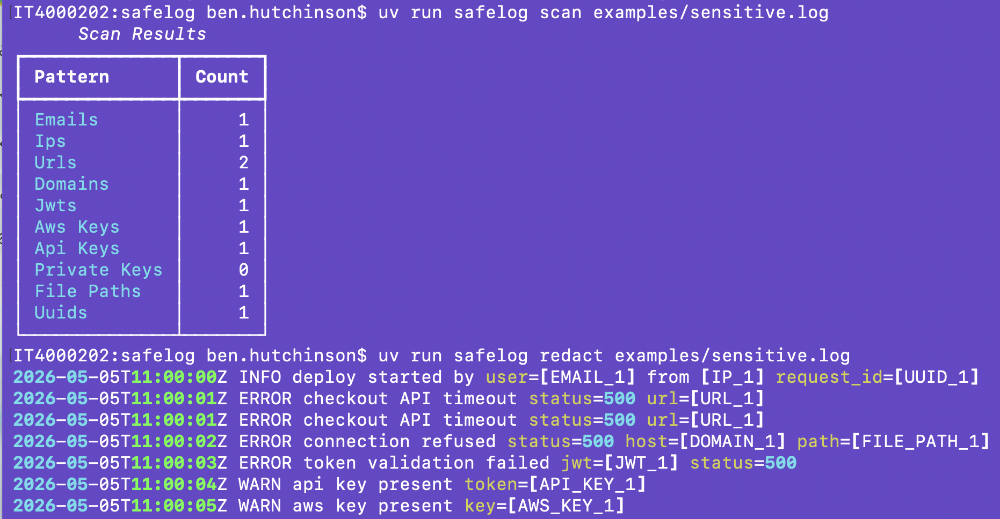
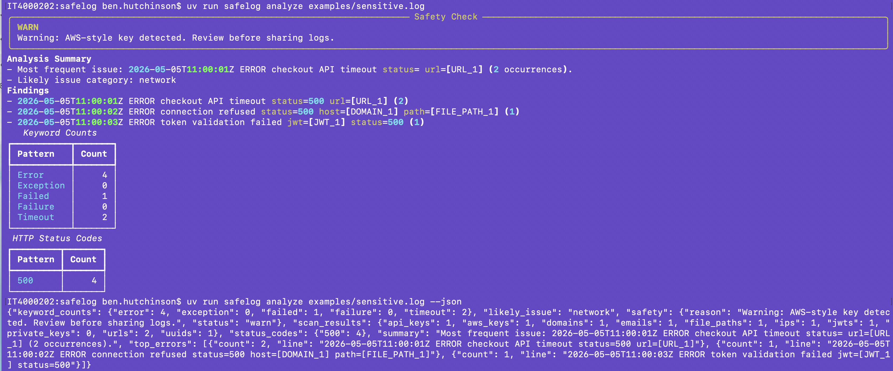

# SafeLog

Privacy-first log analysis for developers.

SafeLog detects sensitive values, redacts them, and analyzes logs locally so you can debug without leaking secrets.

## Why This Exists

Developers often paste logs into AI tools while debugging. Logs commonly contain emails, tokens, API keys, internal hosts, IP addresses, and file paths. SafeLog helps prevent those leaks by redacting sensitive data before analysis.

## Installation

```bash
uv tool install .
```

For local development:

```bash
uv sync
uv run safelog --help
```

## Demo

Run the local demo against a fake log file:

```bash
uv run safelog analyze examples/sensitive.log
```

Scan and redact output:



Example output:

```text
Safety Check: WARN
Warning: AWS-style key detected. Review before sharing logs.

Analysis Summary
- Most frequent issue: ERROR checkout API timeout url=[URL_1] (2 occurrences).
- Likely issue category: network

Findings
- ERROR checkout API timeout url=[URL_1] (2)
- ERROR upstream returned HTTP 500 for checkout request (2)
```

The raw email, IP address, URL, JWT, API key, AWS-style key, domain, file path, and UUID from the log are detected and redacted before analysis.

JSON output is available for automation:

```bash
uv run safelog analyze examples/sensitive.log --json
```

Analyze and JSON output:



```json
{
  "likely_issue": "network",
  "safety": {"status": "warn"},
  "summary": "Most frequent issue: ERROR checkout API timeout url=[URL_1] (2 occurrences)."
}
```

## Usage

```bash
uv run safelog scan examples/sensitive.log
uv run safelog redact examples/sensitive.log
uv run safelog redact examples/sensitive.log --out /tmp/safelog-redacted.log
uv run safelog analyze examples/sensitive.log
uv run safelog analyze examples/sensitive.log --markdown --out /tmp/safelog-report.md
uv run safelog analyze examples/sensitive.log --fail-on warn --max-size 5MB
```

## Privacy Guarantee

- Runs entirely locally
- No external network calls in the MVP
- Raw logs are never sent anywhere
- Analysis is performed on redacted logs only
- `--allow-ai` is a stub and does not send data anywhere

## What SafeLog Detects

- Emails
- IPv4 addresses
- URLs and domains
- JWT tokens
- AWS-style keys
- API keys and tokens
- Private key blocks
- File paths
- UUIDs

## Custom Rules

SafeLog can load add-only custom regex rules from `safelog.toml`. Built-in rules remain active and cannot be disabled by custom config.

```toml
[[rules]]
name = "stripe_secret_key"
pattern = "sk_live_[A-Za-z0-9]+"
label = "STRIPE_KEY"
severity = "block"

[[rules]]
name = "internal_user_id"
pattern = "user_[0-9]+"
label = "USER_ID"
severity = "warn"
```

Run with an explicit rules file:

```bash
uv run safelog scan app.log --rules safelog.toml
uv run safelog redact app.log --rules safelog.toml
uv run safelog analyze app.log --rules safelog.toml
```

If `--rules` is omitted, SafeLog looks for `safelog.toml` from the current directory upward. Custom severities are `safe`, `warn`, and `block`; custom scan keys are reported as `custom_<rule_name>`. The older `--config` flag and `[rules.company_token]` table schema remain supported for compatibility.

## CI/CD Usage

SafeLog is CI-agnostic. The CLI performs scanning, redaction, safety checks, and analysis; CI wrappers are thin layers around the CLI.

### GitHub Actions

```yaml
jobs:
  safelog:
    runs-on: ubuntu-latest
    steps:
      - uses: actions/checkout@v4
      - uses: ./
        with:
          path: "examples/sensitive.log"
          fail-on: "block"
          report-format: "both"
```

### GitLab CI/CD

```yaml
include:
  - local: "ci/gitlab/safelog.gitlab-ci.yml"

variables:
  SAFELOG_PATH: "examples/sensitive.log"
  SAFELOG_FAIL_ON: "block"
```

Reports are written to `safelog-reports/` and can be uploaded as CI artifacts. Raw logs are scanned locally inside the CI runner, analysis uses redacted logs, and SafeLog MVP makes no external network calls.

## How It Works

1. Scan logs for sensitive values.
2. Apply safety rules.
3. Redact sensitive data.
4. Analyze the redacted logs.
5. Output a readable or machine-readable report.

## Development

```bash
uv run ruff format --check .
uv run ruff check .
uv run pytest
uv run pytest --cov=safelog
```

## Limitations

- Regex-based detection may miss uncommon formats
- Token detection is intentionally conservative
- Analysis is heuristic and not full root-cause detection
- Custom rules are add-only; built-in rules cannot be disabled
- AI summaries are not implemented in the MVP

## Roadmap

- Richer custom rule validation
- Configurable redaction labels for built-ins
- More issue categories
- Local AI summaries with explicit opt-in
- Editor integrations
